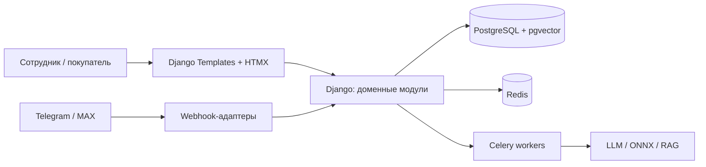

# Onlime CRM

Onlime CRM — проект веб-сервиса для управления продажами и отношениями с
клиентами. Система объединит операционную CRM, каталог, склад, внутренний
финансовый контур, административную панель, личный кабинет покупателя и
интеграции с Telegram, MAX и интеллектуальным агентом.

> Репозиторий содержит минимальную запускаемую веб-оболочку Django. Доменные
> модули пока представлены пустыми границами приложений: бизнес-модели и
> процессы добавляются отдельными вертикальными срезами.

## Цели продукта

- Вести лиды, клиентов, сделки, заказы, оплаты и возвраты.
- Управлять каталогом, ценами, складами, резервами и движениями товаров.
- Давать сотрудникам административный интерфейс с разграничением доступа и
  полным аудитом важных действий.
- Предоставить покупателю личный кабинет с профилем и историей покупок.
- Принимать и обрабатывать обращения через Telegram и MAX.
- Поддерживать умного агента: LLM, ONNX-модели, RAG и гибридный поиск — безопасно
  и с учётом прав доступа.

## Архитектурный подход

Мы начинаем с **модульного монолита Django**. Это не временный компромисс:
для CRM важнее согласованные транзакции между заказом, складом и финансами, чем
ранняя распределённость. Модули имеют чёткие публичные границы и могут быть
выделены в сервисы лишь тогда, когда появится измеримая причина.



Полное описание: [архитектура](docs/architecture/ARCHITECTURE.md),
[решение о модульном монолите](docs/architecture/ADRs/0001-modular-monolith.md),
[стратегия тестирования](docs/testing/TESTING.md).

## Технологический стек

| Задача | Технология |
|---|---|
| Язык и фреймворк | Python 3.13+, Django 5.2 LTS |
| Интерфейс | Django Templates, HTMX, Alpine.js, Tailwind CSS |
| Реальное время | Django Channels, Redis, WebSocket по необходимости |
| Данные, текущий этап | SQLite в persistent volume одного контейнера |
| Данные, целевой этап CRM | PostgreSQL, `pgvector`, Full-Text Search, `pg_trgm` |
| Фоновые операции, целевой этап | Celery + Redis |
| Боты | aiogram 3 для Telegram; отдельный адаптер для MAX |
| ИИ | адаптеры LLM-провайдеров, ONNX Runtime в воркерах |
| Тесты | pytest/Django tests, Playwright, контрактные и RAG evaluation-тесты |
| Поставка | Docker Compose, DockerHosting.ru, GitHub Actions |

## Почему не отдельный SPA-фронтенд

CRM потребует большого числа таблиц, форм, фильтров и операций с высокой ценой
ошибки. Django Templates с HTMX дают реактивность без дублирования моделей,
валидации, прав и API между Python-backend и JavaScript-приложением. Это
значительно снижает объём кода и риск отладки.

Alpine.js допустим только для небольшого локального состояния интерфейса.
WebSocket нужен для живых уведомлений, статусов и экранов мониторинга, но не как
замена обычным формам и запросам.

## Доменные модули

| Модуль | Ответственность |
|---|---|
| `identity` | пользователи, роли, организации, права |
| `customers` | клиенты, контакты, согласия, сегменты |
| `catalog` | товары, услуги, цены, налоги |
| `sales` | лиды, сделки, заказы, оплаты, возвраты |
| `inventory` | склады, резервы, движения, инвентаризации |
| `finance` | управленческие финансовые документы и проводки |
| `customer_portal` | кабинет покупателя и история покупок |
| `notifications` | шаблоны, каналы, доставка сообщений |
| `integrations` | Telegram, MAX, платежи и другие внешние системы |
| `ai` | агент, инструменты, RAG, индексация, контроль доступа |
| `audit` | неизменяемый журнал значимых действий |

## Принципы данных и безопасности

- Деньги и количества хранятся через `Decimal`, без `float`.
- Остатки и финансовые результаты формируются из транзакционных движений, а не
  редактируются напрямую.
- Важные операции аудируются: кто, когда, откуда и что изменил.
- Вебхуки и фоновые задачи идемпотентны.
- Поиск и RAG фильтруют документы по организации и правам до выдачи результатов.
- LLM не имеет прямого доступа к базе: только к строго разрешённым инструментам.
- Секреты передаются переменными окружения; в Git они не попадают.

## Документация

- [Инструкции для агентов](AGENTS.md)
- [Архитектура](docs/architecture/ARCHITECTURE.md)
- [ADR-0001: модульный монолит](docs/architecture/ADRs/0001-modular-monolith.md)
- [Процесс продаж и заказа](docs/processes/SALES_AND_ORDER.md)
- [Процесс склада](docs/processes/INVENTORY.md)
- [Стратегия тестирования](docs/testing/TESTING.md)
- [Развёртывание на DockerHosting.ru](docs/runbooks/DEPLOYMENT_DOCKERHOSTING.md)

## Развёртывание

Целевая площадка — **DockerHosting.ru**. На текущем этапе приложение работает
в **одном контейнере**. SQLite хранится в persistent volume, подключённом к
контейнеру: его нельзя оставлять внутри файловой системы образа.

Это временный этап для запуска базовой веб-оболочки и простых данных. SQLite не
подходит для параллельных операций CRM, очередей, WebSocket-масштабирования,
гибридного поиска и тяжёлых ИИ-задач. До появления заказов с резервированием,
оплат, складских движений, webhook-ботов, RAG или нескольких экземпляров `web`
проект обязательно переходит на PostgreSQL, Redis и Celery.

После перехода Docker Compose станет единым контрактом запуска для локальной
разработки, CI и production. Конфигурация будет различаться переменными окружения
и подключаемыми production-значениями, а не составом прикладного кода.

Целевой состав контейнеров после перехода:

- `web` — Django ASGI-приложение;
- `worker` — обычные Celery-задачи;
- `beat` — планировщик периодических задач в единственном экземпляре;
- `ai-worker` — отдельный воркер для ONNX и ресурсоёмкой ИИ-обработки, когда она
  появится;
- `postgres` — PostgreSQL с `pgvector`;
- `redis` — брокер Celery, cache и Channels layer.

PostgreSQL и Redis будут доступны только во внутренней сети Compose. Их порты не
открываются в интернет. Миграции выполняются контролируемой одноразовой командой
до запуска новой версии web/worker; контейнеры не должны самостоятельно менять
схему при каждом рестарте.

Подробный порядок текущего и целевого развёртывания — в
[runbook развёртывания](docs/runbooks/DEPLOYMENT_DOCKERHOSTING.md).

### Локальный запуск

Требуется Python 3.13+. Команды для Windows:

```bat
python -m venv .venv
.venv\Scripts\activate
python -m pip install --upgrade pip
python -m pip install -r requirements.txt
copy .env.example .env
python manage.py migrate
python manage.py runserver
```

После запуска доступны главная страница `http://127.0.0.1:8000/`, healthcheck
`http://127.0.0.1:8000/health/` и администрирование `http://127.0.0.1:8000/admin/`.

Перед тестовым развёртыванием через Docker Compose скопируйте `.env.example` в
`.env`, обязательно замените `SECRET_KEY`, установите `DEBUG=False`, укажите
фактические `ALLOWED_HOSTS` и HTTPS-настройки. SQLite-файл по умолчанию будет
создан в именованном persistent volume `sqlite_data`; миграции выполняются
отдельно от запуска веб-контейнера.

## План первого функционального среза

1. Аутентификация, организации, роли и журнал аудита.
2. Каталог, клиенты и создание заказа.
3. Резервирование и списание товаров с транзакционными движениями.
4. Регистрация оплаты и отображение истории в кабинете покупателя.
5. Уведомления и Telegram-интеграция через идемпотентные webhook-события.
6. Базовый поиск, затем гибридный поиск и RAG в изолированном модуле.

## Важное ограничение для финансового контура

Сейчас запланирован внутренний управленческий учёт. Юридически значимая
бухгалтерия зависит от страны, налогового режима, обязательных документов и
необходимости интеграции с 1С или иным контуром. Эти требования должны быть
собраны и оформлены отдельным ADR до реализации бухгалтерских функций.

## Как участвовать в разработке

1. Прочитайте `AGENTS.md` и относящиеся к изменению документы в `docs/`.
2. Оформите архитектурно значимое решение отдельным ADR.
3. Реализуйте функцию в границах её доменного модуля.
4. Добавьте тесты и обновите процессную документацию при изменении правил.
5. Пройдите проверки CI до слияния.
